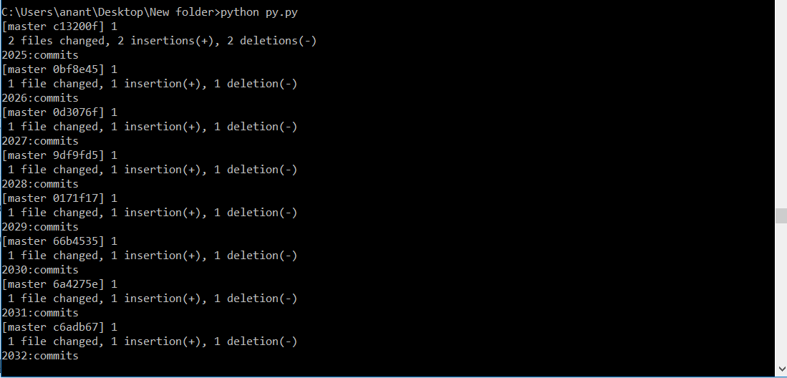

# Get unlimited contributions in your github profile in just few mins

# Paint your commit graph -  `green`

**Want commits in your github?**
 
**Want more contributions?**

**_just few click ahead---_** :smiley:

# Steps to use

- Run `npm i -S git-unlimited-commit`
- Go to the folder containing `py.py` file
- Run `git init`
- Run `git remote add origin [your git repo]`
- Run `python py.py`
   
- Hurrayyy!!! That's it!! Just wait now and your commits will br increasing, check on your github profile
- After Running the script for some time (as per the no. of commits) {After a short While} Press `Cntrl+C` to stop the script. And finally run `git push origin master` to see the reflected changes in github.com/[your_username]/[your_repo_name]

# "12K" Contribution in 24 hrs

## Automated Contributions

#So, I did 12K commits in Github within 24 hrs by running an automated program.

In every 2 hours, the commits will automatically be increased by 1000.

**_See my work. Give_** **⭐️ 👏**

# Directly Use

:fire:
https://www.npmjs.com/package/git-unlimited-commit

# See code

:star:
https://github.com/Anant016/git-unlimited-commits-contributions

# Medium Article

:clap:
https://medium.com/@romedy65i/how-i-did-12k-commits-in-github-within-24-hrs-7908f755fe2d

# Demo

:scream_cat:
https://github.com/coolanant/24hrs-automated-commits

